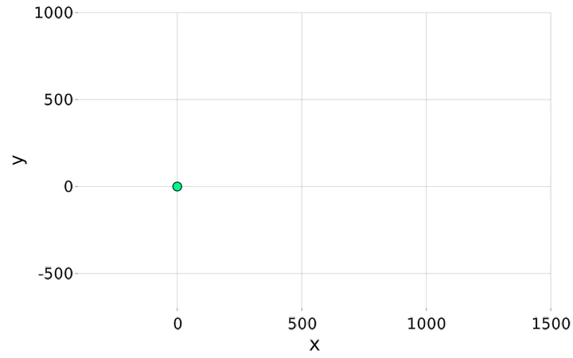

# AdventOfCode2020
Advent of code projects for 2020 - using as a means to practice Julia.

See https://adventofcode.com/ for more information

## Highlights

Here are some solutions I found particularly interesting, or additional plots and graphics I made along the way.

### Solution for December 11

I decided to visualize this variant on Conway's Game of Life, and I quite like how they came out:

Solution 1:
- If a seat is empty (green) and there are no occupied seats adjacent to it, the seat becomes occupied.
- If a seat is occupied (yellow) and four or more seats adjacent to it are also occupied, the seat becomes empty.
- Otherwise, the seat's state does not change.

Solution 2:

As soon as people start to arrive, you realize your mistake. People don't just care about adjacent seats - they care about the first seat they can see in each of those eight directions! (i.e. ignore empty chairs)

Also, people seem to be more tolerant than you expected: it now takes five or more visible occupied seats for an occupied seat to become empty (rather than four or more from the previous rules). The other rules still apply: empty seats that see no occupied seats become occupied, seats matching no rule don't change, and floor never changes.

### Solution for December 12

This question found us tracking a ship as it navigates instructions, given by cardinal directions as well as relative directions based on orientation which rotates. I created a graphic showing the evolution of the venture as instructions pass.

